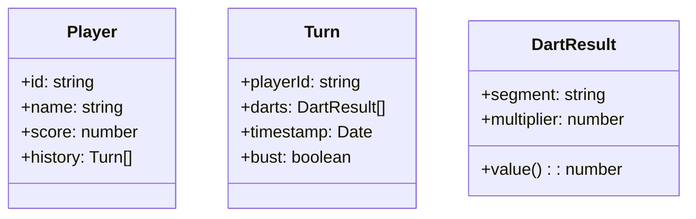

# Agent-Plan: Sprachgesteuerte 501-Dartsapp (HTML/JavaScript)

## Vision & Ziele
- Echtzeit-Mitschnitt eines 501-Leg per Spracheingabe im Browser.
- Minimale Interaktion mit Maus/Tastatur, Fokus auf Sprachbefehle.
- Klarer Spielfluss: Ansage → Validierung → Aktualisierung des Scoreboards.
- Offline-first, aber modular erweiterbar (z. B. Spielhistorie, Multiplayer).

## Zielgruppe & Nutzungsszenarien
- Casual- und Vereinsspieler:innen, die während einer Partie die Hände frei haben wollen.
- Tablets/Notebooks am Dartboard, ggf. mit zusätzlichem Mikrofon.
- Einsätze bei Trainings, Ligaspielen oder Events zur schnellen Dokumentation.

## Projektumfang (MVP)
1. Startbildschirm mit Spielkonfiguration (Leg/Lives, Spieleranzahl).
2. Scoreboard-Ansicht für bis zu zwei Spieler:innen (MVP).
3. Sprachaufnahme über Web Speech API (Chromium-Browser).
4. Erkennung von Scores (0–180) und speziellen Begriffen („Bust“, „Double Out“).
5. Regel-Engine für 501 Double-Out (inkl. Bust-Logik).
6. Verlauf mit letztem Check-out sowie Fehlerfeedback (Missverständnis, ungültige Eingabe).

## Architekturüberblick
- **Frontend**: Single-Page-App, HTML + Vanilla JS, modulare Komponentenstruktur.
- **State Management**: Event-getrieben, zentrales `GameState`-Objekt (aktuelle Scores, Runden, Verlauf).
- **Sprachsteuerung**: Wrapper um die Web Speech API; Fallback auf manuellen Input.
- **UI-Komponenten**:
  - `MatchSetup`: Konfiguration, Start.
  - `Scoreboard`: Anzeigen aktueller Scores, Rechner für Restpunkte.
  - `VoiceConsole`: Status (lauscht, versteht, Fehler).
  - `TurnHistory`: Chronologischer Log der Aufnahmen.
- **Persistenz (optional später)**: LocalStorage für Spielstände und Statistiken.

## Technische Bausteine
- HTML5-Struktur mit semantischen Bereichen (`<header>`, `<main>`, `<section>`).
- CSS Grid/Flexbox für responsive Darstellung (mobile → tablet).
- Web Speech API (`SpeechRecognition`); für Browser ohne Support: Hinweis + manueller Input.
- Testbare Units: Score-Berechnung, Bust-Logik, Parsing der Sprachbefehle.
- Build/Tooling: lightweight (npm + Vite optional), Fokus auf schnelles Iterieren.

## Sprachbefehl-Design
- Eingabeformat: „Ein Triple zwanzig“, „140“, „Single fünf“, „Bust“.
- Normalisierung: Map der gesprochenen Zahlen/Wörter auf int-Werte.
- Fehlertoleranz: Konfidenzschwelle; bei Unklarheit Nachfrage („Bitte wiederholen“).
- Steuerbefehle: „Neues Spiel“, „Rückgängig“, „Stopp“, „Weiter“.

## Workflow einer Runde
1. **Start Turn**: Aktiver Spieler wird hervorgehoben, Timer optional.
2. **Voice Capture**: Aufnahme starten → Resultat parsen → validieren.
3. **Validation**:
   - Score ≤ verbleibende Punkte.
   - Double-Out: Letzter Dart muss Doppel sein (Audio-Intent „Double“).
   - Bust: Automatisch erkannt und Runde beendet.
4. **State Update**: Score abziehen, Rest anzeigen, Check-out-Optionen.
5. **Feedback**: Visuelle + akustische Bestätigung (Text-to-Speech optional).
6. **Turn Switch**: Nächster Spieler; History aktualisieren.

## UI-Wireframe (konzeptionell)
- **Header**: Spielstatus, aktive:r Spieler:in, Restdarts.
- **Main**:
  - Linke Spalte: Scoreboard mit Namen, Restpunkten, Checkout-Tipps.
  - Rechte Spalte: VoiceConsole (Status, letzter Befehl, Retry).
  - Unterhalb: TurnHistory (letzte 5 Eingaben, Scroll).
- **Footer**: Controls (Pause, Rückgängig, Einstellungen).

## Datenmodell (MVP)


## Zustandslogik (Pseudo-Code)
```javascript
function applyDart(gameState, dartResult) {
  const score = dartResult.value();
  const remaining = gameState.activePlayer.score - score;

  if (remaining < 0) return { bust: true };
  if (remaining === 0 && !dartResult.isDouble()) return { bust: true };

  return {
    bust: false,
    updatedScore: remaining
  };
}
```

## Risiken & Annahmen
- Web Speech API funktioniert nur in modernen Chromium-Browsern → Browserprüfung.
- Störgeräusche beim Dartspiel erschweren Sprachverständnis → Option für Push-to-Talk / Headset.
- Mehrspieler >2 erst in späteren Iterationen, Fokus MVP auf 1v1.
- Datenschutz: Keine externe Übertragung (rein lokal).

## Milestones
1. **Prototyp UI**: Statisches Scoreboard + manuelle Eingabe (1 Tag).
2. **Game Engine**: Scorelogik, Bust, Rundenwechsel (1–2 Tage).
3. **Sprachintegration**: Befehle erkennen, Feedback anzeigen (2 Tage).
4. **UX Feinschliff**: Fehlerbehandlung, responsive Layout, Audiofeedback (1 Tag).
5. **Testing & Doku**: Unit Tests für Logik, Kurzanleitung (1 Tag).

## Erweiterungen (nach MVP)
- Statistik-Dashboard (Average, Checkout-Quote).
- Mehrsprachige Sprachbefehle.
- Export (CSV/JSON), Teilen von Legs/Matches.
- Integration mit Darts-Hardware (automatische Treffer).
- Online-Multiplayer mit WebRTC + Voice Rooms.

## Nächste Schritte
- Mockups erstellen (Figma/Whimsical) basierend auf Wireframe.
- User-Interviews (aktive Spieler:innen) zur Feinkonzeption der Sprachbefehle.
- Proof-of-Concept für Sprachbefehle im Zielbrowser.

