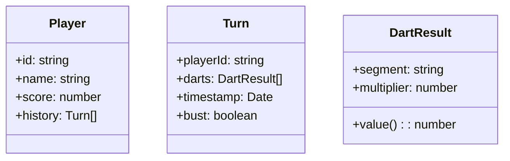

# Agent-Plan: Sprachgesteuerte 501-Dartsapp (HTML/JavaScript)

## Vision & Ziele
- Echtzeit-Mitschnitt eines 501-Leg im Browser.
- Minimale Interaktion mit Maus/Tastatur, Fokus auf Spiel.

## Zielgruppe & Nutzungsszenarien
- Casual- und Vereinsspieler:innen, die während einer Partie das Scoring eingeben wollen.
- Tablets/Notebooks am Dartboard, ggf. mit Toucheingabe.
- Einsätze bei Trainings, Ligaspielen oder Events zur schnellen Dokumentation.

## Projektumfang (MVP)
1. Startbildschirm mit Spielkonfiguration (Leg/Lives, Spieleranzahl).
2. Scoreboard-Ansicht für bis zu vier Spieler:innen (MVP).
3. Regel-Engine fÁr 501 Double-Out (inkl. Bust-Logik).
4. Verlauf mit letztem Check-out sowie Fehlerfeedback

## Architektur├╝berblick
- **Frontend**: Single-Page-App, HTML + Vanilla JS, modulare Komponentenstruktur.
- **State Management**: Event-getrieben, zentrales `GameState`-Objekt (aktuelle Scores, Runden, Verlauf).
- **UI-Komponenten**:
  - `MatchSetup`: Konfiguration, Start.
  - `Scoreboard`: Anzeigen aktueller Scores, Rechner für Restpunkte.
  - `TurnHistory`: Chronologischer Log der Aufnahmen.
- **Persistenz (optional sp├ñter)**: Azure Table Storage für Spielstände und Statistiken.

## Technische Bausteine
- HTML5-Struktur mit semantischen Bereichen (`<header>`, `<main>`, `<section>`).
- CSS Grid/Flexbox für responsive Darstellung (mobile → tablet).
- Testbare Units: Score-Berechnung, Bust-Logik.
- Build/Tooling: lightweight (npm + Vite optional), Fokus auf schnelles Iterieren.


## UI-Wireframe (konzeptionell)
- **Header**: Spielstatus, aktive:r Spieler:in, Restdarts.
- **Main**:
  - Linke Spalte: Scoreboard mit Namen, Restpunkten, Checkout-Tipps.
  - Rechte Spalte: VoiceConsole (Status, letzter Befehl, Retry).
  - Unterhalb: TurnHistory (letzte 20 Eingaben, Scroll). Profil Heatmap
- **Footer**: Controls (Pause, Rückgängig, Einstellungen).

## Datenmodell (MVP)

```mermaid
classDiagram
    class Player {
      +id: string
      +name: string
      +score: number
      +history: Turn[]
    }

    class Turn {
      +playerId: string
      +darts: DartResult[]
      +timestamp: Date
      +bust: boolean
    }

    class DartResult {
      +segment: string
      +multiplier: number
      +value(): number
    }
```

## Zustandslogik (Pseudo-Code)
```javascript
function applyDart(gameState, dartResult) {
  const score = dartResult.value();
  const remaining = gameState.activePlayer.score - score;

  if (remaining < 0) return { bust: true };
  if (remaining === 0 && !dartResult.isDouble()) return { bust: true };

  return {
    bust: false,
    updatedScore: remaining
  };
}
```

## Risiken & Annahmen


## Milestones
1. **Prototyp UI**: Statisches Scoreboard + manuelle Eingabe (1 Tag).
2. **Game Engine**: Scorelogik, Bust, Rundenwechsel (1ΓÇô2 Tage).
4. **UX Feinschliff**: Fehlerbehandlung, responsive Layout, Audiofeedback (1 Tag).
5. **Testing & Doku**: Unit Tests f├╝r Logik, Kurzanleitung (1 Tag).

## Erweiterungen (nach MVP)
- Statistik-Dashboard (Average, Checkout-Quote).
- Export (CSV/JSON), Teilen von Legs/Matches.
- Integration mit Darts-Hardware (automatische Treffer).
- Online-Multiplayer.

## Nächste Schritte
- Turniermodus
- Soundeffekte 180
- Match- & Turnierverwaltung


Ligamodus: Jeder gegen jeden (Round Robin)

Spielplan automatisch erstellen


## Update 2025-11-14
- `doku.md` ergänzt eine kompakte Projektdokumentation inkl. Setup, Voice-Befehlen, Turnier/Leaderboard sowie jetzt auch detaillierter Trainingsbeschreibung.
- Trainingskarte unterstützt nun zwei Modi: Around the Clock (mit Varianten) und das 121 Game (Checkout-Challenge mit 9 Darts, automatischer Bestwert- und Verlaufs-Tracking).
- UI angepasst (Modus-Auswahl, Statusanzeigen, Verlauf) sowie Logik in `app.js` erweitert, damit Treffer/Fehlwurf-Buttons zwischen Zahlenlauf und 121-Session unterscheiden.

